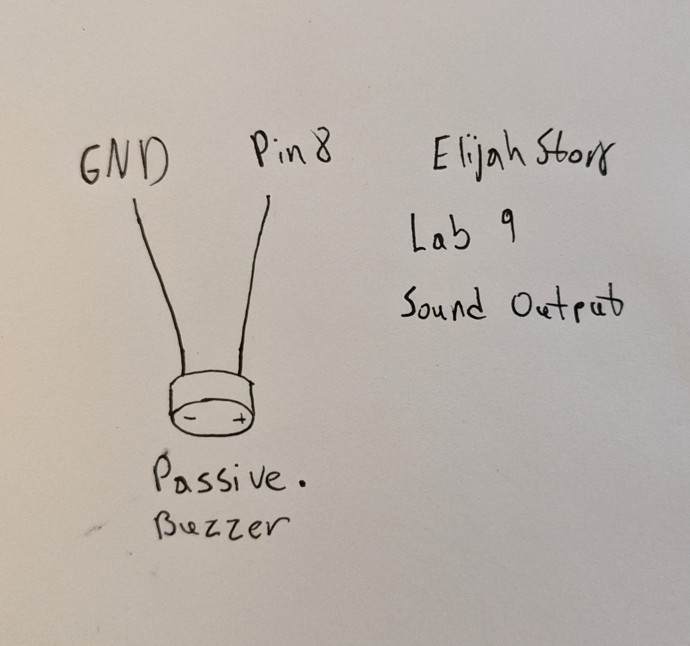
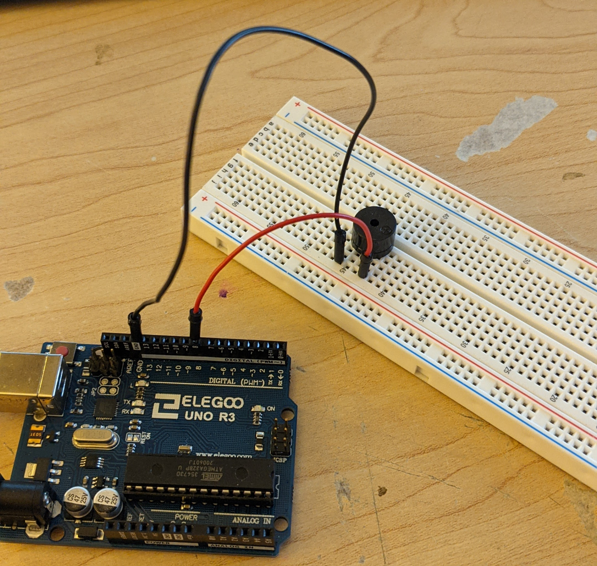

# Lab9-Elijah-Story

## 1:
1. I chose the passive buzzer thinking about my lantern. It was really the only thing I could think of using in the lantern itself out of sight. All it does is buzz however, you can make it buzz to different notes. I used this ability to play a little random song in a loop.

2.
- Below is a diagram of the wiring. It is a very simple circuit. It takes power from pin 8 and is connected to ground.

- The code runs through an array of notes defined in a separate file. Along with the notes, there is an array that has the timings for each note which adds a delay between each note.

[Here is the video.](https://photos.app.goo.gl/16EzsTCNFE9SGHW58)

3. The hardest part was understanding the musical terminology and what each part does. As well as how to make a decent sound.

4. To use this in my lantern I think I will have to make my own timing system to allow the code to run outside of the for loop playing the song. If I leave it how it is now, I think it will put a pause on my motion sensor checking for motion.
