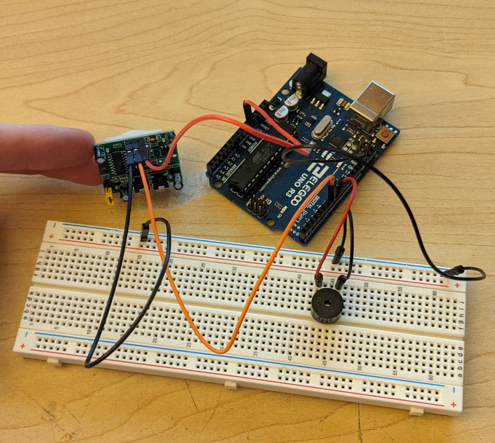

# Lab9-Elijah-Story

## #1
- I chose the passive buzzer thinking about my lantern. It was really the only thing I could think of using in the lantern itself out of sight. All it does is buzz however, you can make it buzz to different notes. I used this ability to play a little random song in a loop.
- Below is a diagram of the wiring. It is a very simple circuit. It takes power from pin 8 and is connected to ground.

- The code runs through an array of notes defined in a separate file. Along with the notes, there is an array that has the timings for each note which adds a delay between each note.

- [Here is the video.](https://photos.app.goo.gl/16EzsTCNFE9SGHW58)
- The hardest part was understanding the musical terminology and what each part does. As well as how to make a decent sound.

- To use this in my lantern I think I will have to make my own timing system to allow the code to run outside of the for loop playing the song. If I leave it how it is now, I think it will put a pause on my motion sensor checking for motion.

## #3
- The buzzer plays a song until the motion sensor detects movement. Once the sensor goes back to outputting LOW, the buzzer starts back up.
- [Here is the video.](https://photos.app.goo.gl/YLU1F3VGqVp5JhANA)
- Below is the wiring diagram. The motion sensor gets power from the 5v and is connected to the ground. It outputs to pin 7. The buzzer is connected to ground and gets its power from pin 8.

## #4
- This is my final lantern design. It has a button to turn it on/off. The lantern itself has a flickering LED as well as a passive buzzer under a paper mache dome. The light and buzzer are on if the button is on and the motion sensor does not detect any movement. [Here is the video of the final lantern.]()

- Below is a diagram of the wiring. The motion sensor simply gets power from a 5v supply and is connected to ground. Its output is connected to pin 7. For the button, the power runs to the button and waits. Once the button is pressed, the power splits and goes to pin 4 and passes through a 10k resistor before grading to ground. The LED has the power that comes from pin 10, passes through a 330 resistor and out to ground. The buzzer is connected to ground and gets its power from pin 8.

